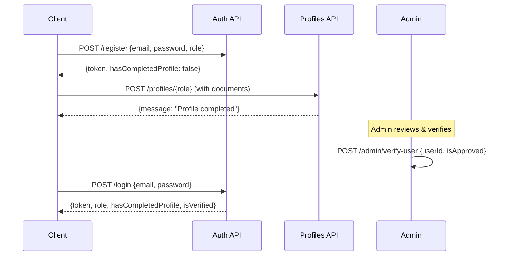

<p align="center">
  
  
  
  
  
</p>

<h1 align="center">🏥 R3AIA (رعاية) — Backend API</h1>

<p align="center">
  <strong>A Charitable Medical Platform Connecting Patients with Doctors, Pharmacies & Volunteers</strong>
</p>

<p align="center">
  <em>RESTful API backend powering the R3AIA healthcare ecosystem — providing free and discounted medical consultations, medicine fulfillment, and volunteer-based delivery services across Egyptian governorates.</em>
</p>

---

## 📋 Table of Contents

- [Overview](#-overview)
- [Architecture](#-architecture)
- [Tech Stack](#-tech-stack)
- [Features](#-features)
- [User Roles](#-user-roles)
- [API Endpoints](#-api-endpoints)
- [Database Schema](#-database-schema)
- [Getting Started](#-getting-started)
- [Configuration](#-configuration)
- [Project Structure](#-project-structure)
- [Authentication Flow](#-authentication-flow)
- [Business Logic](#-business-logic)
- [Contributing](#-contributing)
- [License](#-license)

---

## 🌟 Overview

**R3AIA (رعاية)** is a charitable medical platform designed to bridge the gap between patients in need and healthcare providers willing to volunteer their services. The platform facilitates:

- 🩺 **Free & Discounted Medical Consultations** — Patients submit consultation requests matched to doctors by specialty and location
- 💊 **Medicine Fulfillment** — Prescription-based medicine requests fulfilled by local pharmacies
- 🚚 **Volunteer Delivery** — Community volunteers deliver medications to patients' homes
- 💰 **Donation System** — Transparent donation cases with progress tracking
- 🎟️ **Support Tickets** — Full ticketing system with real-time chat between users and admins

---

## 🏗 Architecture

The project follows a **clean layered architecture** with the Repository Pattern:

```
┌──────────────────────────────────────────────────┐
│                  Controllers                      │
│   (API Endpoints & Request/Response Handling)     │
├──────────────────────────────────────────────────┤
│               DTOs (Data Transfer Objects)        │
│          (Request/Response Models)                │
├──────────────────────────────────────────────────┤
│             Repositories (Business Logic)         │
│   IAccountRepository │ IMedicalRequestRepository  │
│   IMedicineRepository│ IDeliveryRepository        │
│   IDonationRepository│ ISupportRepository         │
│   IAdminRepository   │                            │
├──────────────────────────────────────────────────┤
│                   Services                        │
│   JwtService │ FileService │ NotificationService  │
├──────────────────────────────────────────────────┤
│          Models & Entity Framework Core           │
│        (AppDbContext + Identity Framework)         │
├──────────────────────────────────────────────────┤
│              SQL Server Database                  │
└──────────────────────────────────────────────────┘
```

---

## 🛠 Tech Stack

| Layer | Technology |
|---|---|
| **Runtime** | .NET 9.0 |
| **Framework** | ASP.NET Core Web API |
| **ORM** | Entity Framework Core 9.0 |
| **Database** | Microsoft SQL Server |
| **Authentication** | ASP.NET Core Identity + JWT Bearer Tokens |
| **Object Mapping** | AutoMapper 12.0 |
| **API Documentation** | Swagger / Swashbuckle |
| **File Storage** | Local disk (`wwwroot/Uploads/`) |

---

## ✨ Features

### 🔐 Authentication & Authorization
- JWT-based authentication with role-based access control (RBAC)
- Multi-step registration: Register → Complete Profile → Admin Verification
- Password change & reset functionality
- Account status management (Active, Pending, Banned)

### 🩺 Medical Consultations
- Smart request routing based on **specialty + governorate** matching
- Multi-image upload for medical documents (up to 20MB)
- Appointment scheduling with future-date validation
- Request lifecycle: `Pending → Accepted → Completed / Cancelled`
- Bi-directional cancellation (Patient or Doctor) with reason tracking

### 💊 Medicine Requests
- Prescription image upload with pharmacy fulfillment
- Optional home delivery flag
- Geographic matching — pharmacies see requests from same governorate
- Full tracking from request to delivery

### 🚚 Volunteer Delivery System
- Available delivery tasks for verified volunteers
- Task lifecycle: `Available → Taken → OutForDelivery → Delivered`
- Real-time notifications at each status change
- Dual delivery tracking (via `MedicineRequests` and `DeliveryTasks`)

### 💰 Donation System
- Admin-managed donation cases with goal amounts
- Progress tracking with image uploads
- Receipt-based donation submissions
- Approval workflow for donation verification

### 🎟️ Support Ticket System
- Threaded messaging between users and admins
- Automated initial response
- Soft-delete with dual-party logic (hard delete when both sides delete)
- Status management: `Open → Closed`

### 📊 Dashboard Statistics
- Role-specific stats endpoints (Patient, Doctor, Pharmacy, Volunteer, Admin)
- Stalled/urgent request monitoring with configurable thresholds
- Admin broadcast notifications (global or role-targeted)

### 🏥 Discounted Doctors Directory
- Public listing of verified doctors with free/discounted consultations
- Filtering by specialty, governorate, and city
- Clinic appointment booking system

### 🔔 Notification Engine
- Per-user notifications with read/unread tracking
- Actionable notifications with deep-link URLs
- Broadcast to all users or specific roles
- Urgent SOS broadcasting for stalled requests

---

## 👥 User Roles

| Role | Description | Key Capabilities |
|---|---|---|
| **Admin** | Platform administrator | Verify users, manage donations, handle reports, broadcast notifications, monitor stalled requests, ban/unban users |
| **Patient** | Healthcare recipient | Request consultations, request medicines, track requests, donate, submit reports |
| **Doctor** | Medical professional | View matching consultations, respond with appointments, manage clinic appointments |
| **Pharmacist** | Pharmacy operator | View open medicine requests, fulfill prescriptions, provide notes |
| **Volunteer** | Delivery volunteer | Accept delivery tasks, update delivery status, mark as delivered |

---

## 📡 API Endpoints

### 🔑 Authentication (`/api/Auth`)

| Method | Endpoint | Auth | Description |
|---|---|---|---|
| `POST` | `/register` | Public | Register new user |
| `POST` | `/login` | Public | Login & receive JWT |
| `POST` | `/change-password` | 🔒 User | Change current password |
| `POST` | `/reset-password` | Public | Reset password via NationalID + Email |

### 👤 Profiles (`/api/Profiles`)

| Method | Endpoint | Auth | Description |
|---|---|---|---|
| `GET` | `/me` | 🔒 User | Get current user profile |
| `POST` | `/patient` | 🔒 Patient | Complete patient profile (multipart) |
| `PUT` | `/patient` | 🔒 Patient | Update patient profile |
| `POST` | `/doctor` | 🔒 Doctor | Complete doctor profile (multipart) |
| `POST` | `/pharmacy` | 🔒 Pharmacist | Complete pharmacy profile |
| `POST` | `/volunteer` | 🔒 Volunteer | Complete volunteer profile |

### 🩺 Medical Requests (`/api/MedicalRequests`)

| Method | Endpoint | Auth | Description |
|---|---|---|---|
| `POST` | `/create` | 🔒 Patient | Create consultation request (multipart) |
| `GET` | `/my-requests` | 🔒 Patient | Get patient's own requests |
| `POST` | `/cancel/{id}` | 🔒 Patient | Cancel a request |
| `POST` | `/complete/{id}` | 🔒 Patient | Mark as completed |
| `GET` | `/for-doctor` | 🔒 Doctor | Get matching requests |
| `GET` | `/accepted-requests` | 🔒 Doctor | Get accepted requests |
| `GET` | `/detail/{id}` | 🔒 Doctor | Get full request details |
| `POST` | `/respond/{id}` | 🔒 Doctor | Respond with appointment |
| `POST` | `/cancel-by-doctor/{id}` | 🔒 Doctor | Doctor cancels request |

### 💊 Medicine Requests (`/api/MedicineRequests`)

| Method | Endpoint | Auth | Description |
|---|---|---|---|
| `POST` | `/` | 🔒 Patient | Create medicine request (multipart) |
| `GET` | `/my-requests` | 🔒 Patient | Get patient's requests |
| `GET` | `/open` | 🔒 Pharmacist | Get open requests in governorate |
| `POST` | `/accept/{id}` | 🔒 Pharmacist | Accept/fulfill request |
| `GET` | `/delivery-tasks` | 🔒 Volunteer | Get available delivery tasks |
| `POST` | `/take-delivery/{id}` | 🔒 Volunteer | Take a delivery task |
| `POST` | `/mark-delivered/{id}` | 🔒 Volunteer | Confirm delivery |

### 🚚 Delivery (`/api/Delivery`)

| Method | Endpoint | Auth | Description |
|---|---|---|---|
| `GET` | `/available` | 🔒 Volunteer | Get available tasks |
| `POST` | `/accept` | 🔒 Volunteer | Accept a task |
| `PUT` | `/status` | 🔒 Volunteer | Update task status |
| `GET` | `/my-tasks` | 🔒 Volunteer | Get my assigned tasks |

### 💰 Donations (`/api/Donations`)

| Method | Endpoint | Auth | Description |
|---|---|---|---|
| `GET` | `/cases` | Public | Get active donation cases |
| `POST` | `/pay` | 🔒 User | Submit a donation (multipart) |

### 🛡 Admin (`/api/Admin`)

| Method | Endpoint | Auth | Description |
|---|---|---|---|
| `GET` | `/pending-users` | 🔒 Admin | List pending verifications |
| `GET` | `/pending-users-details` | 🔒 Admin | Detailed pending users with profiles |
| `GET` | `/all-users` | 🔒 Admin | List all users |
| `GET` | `/user-details/{userId}` | 🔒 Admin | Get user details with profile |
| `POST` | `/verify-user` | 🔒 Admin | Approve/reject user |
| `POST` | `/create-case` | 🔒 Admin | Create donation case (multipart) |
| `GET` | `/all-donation-cases` | 🔒 Admin | List all donation cases |
| `PUT` | `/donation-cases/{id}` | 🔒 Admin | Edit donation case |
| `DELETE` | `/donation-cases/{id}` | 🔒 Admin | Delete donation case |
| `POST` | `/broadcast-notification` | 🔒 Admin | Send notifications |
| `GET` | `/all-reports` | 🔒 Admin | Get user reports |
| `PUT` | `/resolve-report` | 🔒 Admin | Resolve a report |
| `GET` | `/stalled-requests` | 🔒 Admin | Get stalled requests |
| `GET` | `/request-detail` | 🔒 Admin | Get request details |
| `POST` | `/ban-user/{userId}` | 🔒 Admin | Ban user |
| `POST` | `/unban-user/{userId}` | 🔒 Admin | Unban user |
| `POST` | `/broadcast-urgent` | 🔒 Admin | Broadcast urgent SOS |

### 🎟️ Support Tickets (`/api/Tickets`)

| Method | Endpoint | Auth | Description |
|---|---|---|---|
| `POST` | `/` | 🔒 User | Create ticket |
| `GET` | `/my-tickets` | 🔒 User | Get user's tickets |
| `GET` | `/{id}` | 🔒 User/Admin | Get ticket with messages |
| `POST` | `/{id}/reply` | 🔒 User/Admin | Reply to ticket |
| `POST` | `/{id}/close` | 🔒 User/Admin | Close ticket |
| `DELETE` | `/{id}` | 🔒 User/Admin | Soft-delete ticket |
| `GET` | `/admin/all` | 🔒 Admin | Get all tickets |

### 📊 Stats (`/api/Stats`)

| Method | Endpoint | Auth | Description |
|---|---|---|---|
| `GET` | `/patient` | 🔒 Patient | Patient dashboard stats |
| `GET` | `/doctor` | 🔒 Doctor | Doctor dashboard stats |
| `GET` | `/pharmacy` | 🔒 Pharmacist | Pharmacy dashboard stats |
| `GET` | `/volunteer` | 🔒 Volunteer | Volunteer dashboard stats |
| `GET` | `/admin` | 🔒 Admin | Admin dashboard stats |
| `GET` | `/urgent-cases/doctor` | 🔒 Doctor | Urgent cases for doctor |
| `GET` | `/urgent-cases/pharmacist` | 🔒 Pharmacist | Urgent cases for pharmacist |
| `GET` | `/urgent-cases/volunteer` | 🔒 Volunteer | Urgent cases for volunteer |

### 🏥 Discounted Doctors (`/api/DiscountedDoctors`)

| Method | Endpoint | Auth | Description |
|---|---|---|---|
| `GET` | `/` | Public | List discounted doctors (with filters) |
| `GET` | `/{id}` | Public | Get doctor details |

### 📅 Clinic Appointments (`/api/ClinicAppointments`)

| Method | Endpoint | Auth | Description |
|---|---|---|---|
| `POST` | `/` | Public | Book appointment |
| `GET` | `/my-appointments` | 🔒 Doctor | Get doctor's appointments |
| `PUT` | `/{id}/status` | 🔒 Doctor | Update appointment status |

### 🔧 Lookup Data

| Method | Endpoint | Description |
|---|---|---|
| `GET` | `/api/Governorates` | List all governorates |
| `GET` | `/api/Cities?governorateId={id}` | Cities by governorate |
| `GET` | `/api/Specialties` | Medical specialties |
| `GET` | `/api/Support/notifs` | User notifications |
| `PATCH` | `/api/Support/mark-read/{id}` | Mark notification read |
| `PATCH` | `/api/Support/mark-all-read` | Mark all read |
| `DELETE` | `/api/Support/delete-notif/{id}` | Delete notification |
| `POST` | `/api/Support/report` | Submit user report |

---

## 🗄 Database Schema

### Core Entities

```
ApplicationUser (ASP.NET Identity)
├── FullName, NationalID, UserType
├── AccountStatus (Active/Pending/Banned)
├── IsVerified, HasCompletedProfile
│
├─── Patient
│    ├── PhoneNumber, Address, GovernorateId, CityId
│    ├── NIDFrontImage, NIDBackImage, SocialProofImage
│    └── HasChronicDisease
│
├─── Doctor
│    ├── PhoneNumber, SpecialtyId, GovernorateId, CityId
│    ├── ClinicAddress, ClinicPhone, WorkingHours
│    ├── ProfileImage, LicenseImage, Description
│    ├── ConsultationType (Free/Discounted)
│    └── OriginalPrice, DiscountedPrice
│
├─── Pharmacy
│    ├── PharmacyName, PhoneNumber
│    └── GovernorateId, CityId, Address
│
└─── Volunteer
     ├── FullName, NationalID, PhoneNumber
     └── GovernorateId

MedicalRequest
├── PatientId, DoctorId, SpecialtyId
├── Description, MedicalImages
├── AppointmentDate, DoctorNotes
├── RequestStatus, CancellationReason
└── CreatedAt

MedicineRequest
├── PatientId, PharmacyId
├── PrescriptionImageUrl, NeedDelivery
├── PharmacyNotes, RequestStatus
├── DeliveryStatus, VolunteerId
└── CreatedAt

DeliveryTask
├── MedicineRequestId, VolunteerId
├── TaskStatus (Available/Taken/OutForDelivery/Delivered)
└── CreatedAt

DonationCase
├── Title, Description, GoalAmount
├── CurrentAmount, ImageUrl, IsCompleted
└── CreatedAt

Donation
├── CaseId, UserId, Amount
├── ReceiptImageUrl, Status
└── CreatedAt

SupportTicket ──── SupportTicketMessage
├── UserId, Subject          ├── TicketId, SenderId
├── Status, IsDeletedByUser  ├── Message, IsFromAdmin
└── IsDeletedByAdmin         └── CreatedAt

Notification
├── UserId, Title, Message
├── ActionUrl, IsRead
└── CreatedAt

UserReport
├── ReporterId, ReportedUserId
├── Reason, AdminComment
├── IsResolved
└── CreatedAt

Governorate ──── City
Specialty
ClinicAppointment
```

---

## 🚀 Getting Started

### Prerequisites

- [.NET 9.0 SDK](https://dotnet.microsoft.com/download/dotnet/9.0) or later
- [SQL Server](https://www.microsoft.com/en-us/sql-server) (LocalDB, Express, or full instance)
- [Visual Studio 2022](https://visualstudio.microsoft.com/) or VS Code with C# DevKit

### Installation

1. **Clone the repository**
   ```bash
   git clone https://github.com/YOUR_USERNAME/R3AIA-PROJECT-APIs.git
   cd R3AIA-PROJECT-APIs
   ```

2. **Restore NuGet packages**
   ```bash
   dotnet restore
   ```

3. **Update the connection string** in `R3AIA/appsettings.json`:
   ```json
   {
     "ConnectionStrings": {
       "R3AIA": "Server=YOUR_SERVER;Database=R3AIA_DB;Trusted_Connection=True;TrustServerCertificate=True"
     }
   }
   ```

4. **Apply database migrations**
   ```bash
   cd R3AIA
   dotnet ef database update
   ```

5. **Run the application**
   ```bash
   dotnet run
   ```

6. **Access Swagger UI** at:
   ```
   https://localhost:5001/swagger
   ```

### Default Admin Account
On first run, the application seeds a default admin:
| Field | Value |
|---|---|
| Email | `admin@r3aia.local` |
| Password | `Admin@12345` |

> ⚠️ **Important:** Change the default admin password immediately in production.

---

## ⚙️ Configuration

### `appsettings.json`

```json
{
  "ConnectionStrings": {
    "R3AIA": "YOUR_CONNECTION_STRING"
  },
  "Jwt": {
    "Key": "YOUR_SECRET_KEY_MIN_32_CHARS",
    "Issuer": "R3AIA.Api",
    "Audience": "R3AIA.Clients",
    "DurationInMinutes": 60
  }
}
```

### Environment Variables

| Variable | Description | Default |
|---|---|---|
| `ConnectionStrings__R3AIA` | SQL Server connection string | — |
| `Jwt__Key` | JWT signing key (min 32 chars) | — |
| `Jwt__DurationInMinutes` | Token expiry in minutes | `60` |

### CORS Policy

The API is configured with an `AllowAll` CORS policy for development. **Restrict this in production:**
```csharp
policy.WithOrigins("https://your-frontend-domain.com")
```

---

## 📁 Project Structure

```
R3AIA PROJECT API/
│
├── R3AIA PROJECT API.sln          # Solution file
│
└── R3AIA/                         # Main API project
    ├── Program.cs                 # Application entry point & middleware config
    ├── R3AIA.csproj               # Project dependencies
    ├── appsettings.json           # Configuration
    │
    ├── Controllers/               # API Controllers (15 controllers)
    │   ├── AuthController.cs              # Authentication endpoints
    │   ├── ProfilesController.cs          # Profile management
    │   ├── MedicalRequestsController.cs   # Consultation requests
    │   ├── MedicineRequestsController.cs  # Medicine requests
    │   ├── DeliveryController.cs          # Delivery task management
    │   ├── DonationsController.cs         # Donation system
    │   ├── AdminController.cs             # Admin operations
    │   ├── StatsController.cs             # Dashboard statistics
    │   ├── SupportController.cs           # Notifications & reports
    │   ├── TicketsController.cs           # Support ticket system
    │   ├── DiscountedDoctorsController.cs # Doctor directory
    │   ├── ClinicAppointmentsController.cs# Appointment booking
    │   ├── GovernoratesController.cs      # Governorate lookup
    │   ├── CitiesController.cs            # City lookup
    │   └── SpecialtiesController.cs       # Specialty lookup
    │
    ├── Models/                    # Entity models (20 models)
    │   ├── AppDbContext.cs                # EF Core DbContext
    │   ├── ApplicationUser.cs             # Identity user extension
    │   ├── Patient.cs / Doctor.cs / Pharmacy.cs / Volunteer.cs
    │   ├── MedicalRequest.cs / MedicineRequest.cs
    │   ├── DeliveryTask.cs / DonationCase.cs / Donation.cs
    │   ├── SupportTicket.cs / SupportTicketMessage.cs
    │   ├── Notification.cs / UserReport.cs
    │   ├── ClinicAppointment.cs
    │   ├── Governorate.cs / City.cs / Specialty.cs
    │   └── Enums.cs                       # All enumerations
    │
    ├── DTOs/                      # Data Transfer Objects (14 files)
    │   ├── AuthDtos.cs                    # Login, Register, Password DTOs
    │   ├── ProfileDtos.cs                 # Profile completion DTOs
    │   ├── MedicalDtos.cs                 # Medical request DTOs
    │   ├── MedicineDtos.cs                # Medicine request DTOs
    │   ├── DeliveryDtos.cs                # Delivery task DTOs
    │   ├── DonationDtos.cs                # Donation DTOs
    │   ├── TicketDtos.cs                  # Support ticket DTOs
    │   └── Admin*Dtos.cs                  # Admin operation DTOs
    │
    ├── Repositories/              # Business logic layer (7 repositories)
    │   ├── IAccountRepository.cs          # Auth & user management
    │   ├── IMedicalRequestRepository.cs   # Consultation logic
    │   ├── IMedicineRepository.cs         # Medicine request logic
    │   ├── IDeliveryRepository.cs         # Delivery task logic
    │   ├── IDonationRepository.cs         # Donation logic
    │   ├── ISupportRepository.cs          # Notifications & reports
    │   └── IAdminRepository.cs            # Admin operations
    │
    ├── Services/                  # Shared services
    │   ├── JwtService.cs                  # JWT token generation
    │   ├── FileService.cs                 # Image upload handling
    │   └── NotificationService.cs         # In-app notification engine
    │
    ├── Mapping/
    │   └── MappingProfile.cs              # AutoMapper configuration
    │
    ├── Data/
    │   └── IdentitySeeder.cs              # Role & admin seeding
    │
    ├── Migrations/                # EF Core migrations
    └── wwwroot/                   # Static files & uploads
```

---

## 🔐 Authentication Flow



### JWT Token Claims

| Claim | Description |
|---|---|
| `sub` | User ID |
| `unique_name` | Username |
| `nameid` | User ID (duplicate for compatibility) |
| `name` | Full Name |
| `role` | User Role(s) |
| `AccountStatus` | Active / Pending / Banned |

---

## 📋 Business Logic

### Request Routing Algorithm

**Medical Consultations** are automatically matched based on:
- 🏥 **Specialty** — Doctor's specialty must match the requested specialty
- 📍 **Governorate** — Patient and Doctor must be in the same governorate

**Medicine Requests** are routed based on:
- 📍 **Governorate** — Pharmacy must be in the same governorate as the patient

### Stalled Request Monitoring

The admin dashboard monitors requests that haven't been accepted within a configurable time threshold (default: 60 minutes). Admins can broadcast **Urgent SOS** notifications to eligible service providers.

### User Verification Workflow

```
Registration → Profile Completion → Admin Review → Verification
     │                │                    │              │
   Pending         Documents           Approve/        Active
   Account         Uploaded            Reject          Account
```

---

## 🤝 Contributing

1. Fork the repository
2. Create a feature branch (`git checkout -b feature/amazing-feature`)
3. Commit your changes (`git commit -m 'Add amazing feature'`)
4. Push to the branch (`git push origin feature/amazing-feature`)
5. Open a Pull Request

---

## 📄 License

This project is part of a **Graduation Project** and is provided for educational purposes.

---

<p align="center">
  Made with ❤️ for a healthier Egypt 🇪🇬
</p>
